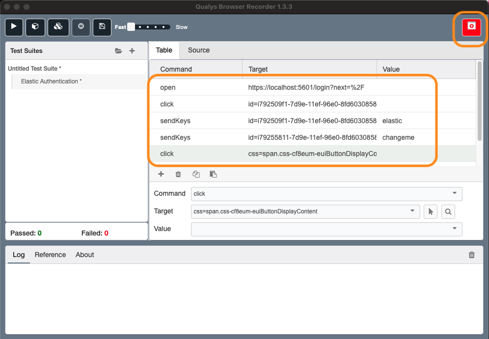
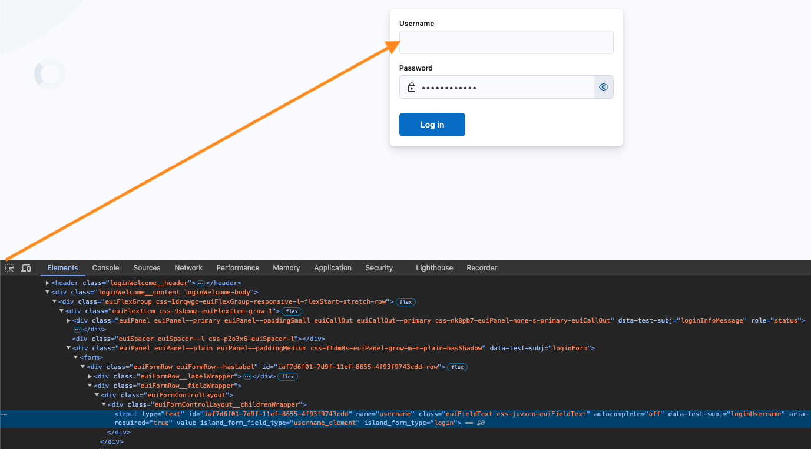
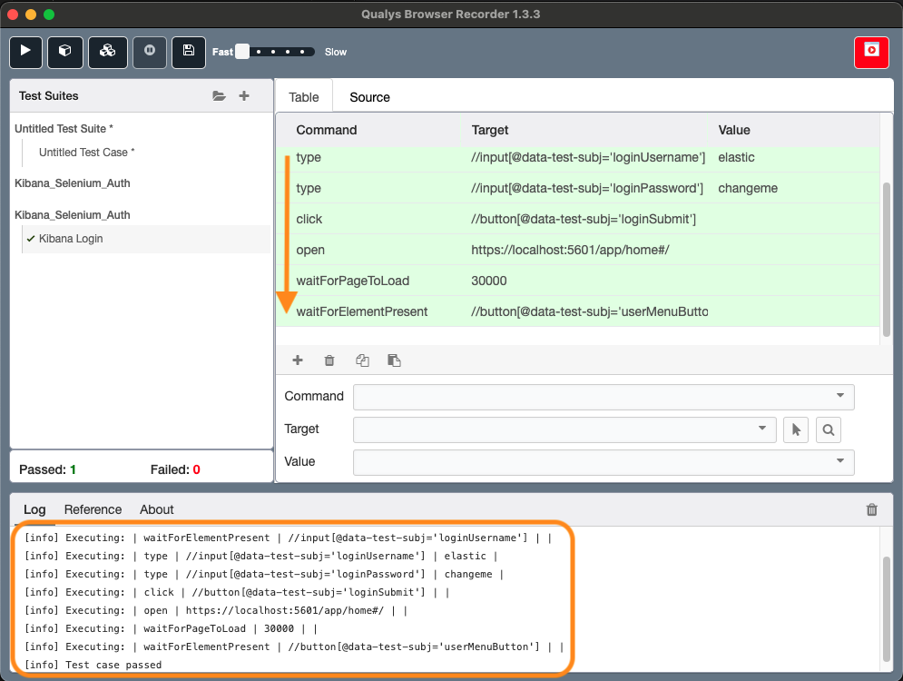
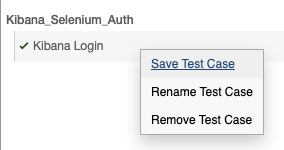
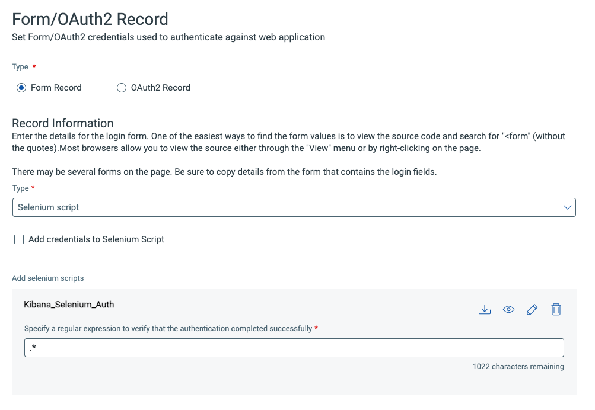

+++
title = "Qualys Web Application: how to configure Selenium authentication?"
date = 2024-09-29
summary = "Discover why and how a static site generator like Hugo can be a game-changer for your blog's security, performance, and cost efficiency."
slug = 'qualys-web-application-scanning-how-to-configure-selenium-authentication'
draft = true
+++


Securing web applications is an essential aspect of protecting an infrastructure from cyber threats. A key step in this process is conducting authenticated scans to identify vulnerabilities that could be exploited by malicious users. In this blog post, I'll walk through the process of configuring Selenium authentication with the [Qualys Web Application Scanner](https://www.qualys.com/apps/web-app-scanning/) (WAS).

## Why and how performing an authenticated scan?

Performing an authenticated scan is essential for testing web applications that have restricted areas or require user authentication to access. By using authenticated scanning, you can simulate different user roles within your application, gaining a more comprehensive understanding of its security posture.

Qualys Web Application Scanning (WAS) offers various authentication methods to help you achieve this:

- Form-based authentication: 
  - Standard Login: A straightforward login process that's easy to configure.
  - Custom: More flexibility in setting up your login process, but still limited in its customization capabilities.
  - Selenium script: The ultimate level of control, allowing you to script every step of the authentication process. This is particularly useful for complex or custom authentication flows.
- OAuth2 authentication:
    - Authorisation Code
    - Implicit
    - Client Credentials
    - Resource Owner Password Credentials
- Server-based authentication:
  - Basic
  - Digest
  - NTLM

Based on [Qualys documentation](https://qualysguard.qg2.apps.qualys.com/portal-help/en/was/authentication/authentication_basics.htm), OAuth2 should only be used for Swagger/Open API file authentication.

 I'll delve into configuring form-based authentication using Selenium. This approach provides full control over the authentication process, making it ideal when custom scripts are required. Selenium can also be used for OAuth2 authentication.

## What is Selenium?

Selenium is an open-source framework widely utilized for automating browser-based interactions and testing web applications. It offers robust features that allow developers and testers to interact with various elements on a webpage programmatically, making it an ideal choice for automating tasks such as user authentication. In our example, I’ll utilize Selenium's capabilities to authenticate on a login form page

## Creating the selenium authentication with Qualys Browser Recorder extension

The easiest way to create a selenium Qualys WAS authentication script is to [install the extension](https://chromewebstore.google.com/detail/qualys-browser-recorder/abnnemjpaacaimkkepphpkaiomnafldi) developed by Qualys. It seems only compatible with chrome based browsers.

Once installed, I clicked the *Record* button on the top right corner to start recording. Through the different actions I’ve done, I can see the commands that are listed within the Qualys extension. Once done I clicked on the stop record button. 



I need to update commands to make them more generic and less tight to this current deployment. This is a manual work that can be done with the help  of the browser inspector. 



Here is the final selenium authentication script for authenticating on Kibana. 

```xml
<?xml version="1.0" encoding="UTF-8"?>
<!DOCTYPE html PUBLIC "-//W3C//DTD XHTML 1.0 Strict//EN" "http://www.w3.org/TR/xhtml1/DTD/xhtml1-strict.dtd">
<html xmlns="http://www.w3.org/1999/xhtml" xml:lang="en" lang="en">
    <head>
        <meta http-equiv="Content-Type" content="text/html; charset=UTF-8" />
        <link rel="selenium.base" href="https://localhost:5601/" />
        <title>Kibana_Selenium_Auth</title>
    </head>
    <body>
        <table cellpadding="1" cellspacing="1" border="1">
            <thead>
                <tr><td rowspan="1" colspan="3">Kibana Login</td></tr>
            </thead>
            <tbody>
                <tr><td>open</td><td>https://localhost:5601/login</td><td></td></tr>
                <tr><td>waitForPageToLoad</td><td>30000</td><td></td></tr>
                <tr><td>waitForElementPresent</td><td>//input[@data-test-subj='loginUsername']</td><td></td></tr>
                <tr><td>type</td><td>//input[@data-test-subj='loginUsername']</td><td>elastic</td></tr>
                <tr><td>type</td><td>//input[@data-test-subj='loginPassword']</td><td>changeme</td></tr>
                <tr><td>click</td><td>//button[@data-test-subj='loginSubmit']</td><td></td></tr>
                <tr><td>open</td><td>https://localhost:5601/app/home#/</td><td></td></tr>
                <tr><td>waitForPageToLoad</td><td>30000</td><td></td></tr>
                <tr><td>waitForElementPresent</td><td>//button[@data-test-subj='userMenuButton']</td><td></td></tr>
            </tbody>
        </table>
    </body>
</html>
```

To verify that the Qualys Web Application Scanning integration with Selenium is working as expected, we can run the selenium script directly from within the Qualys Browser Recorder. Prior to running a test, it's crucial to clear any authentication cookies in the browser to guarantee successful authentication.



The selenium script can be exported by saving the _test_ case. 



## Creating the Qualys authentication record

In Qualys WAS, we must create an authentication record, and then associate it with one or many web applications. 

To add a new authenticated record, we must go to _Configuration_ and then _Authentication_. The wizard is pretty straighforward. In the _regular expression to verify that the authentication completed successfully_, I've configured with `.*`, Qualys suggests to use _logout_, to ensure it's only accessible while logged in.



Once done, we need to associate the authentication record with the web application (in the web application settings). The easiest way is to open the drop down menu of the authentication record recently created and click on _Add To Web Applications_. If we want to associate multiple records to one web application, we can repeat this task. 

## Testing authentication

In the Applications menu, we can open the drop-down menu of the web applications and select _Test authentication_. We need to select the authentication record that will be evaluated. 

Once complete, we can see the result in the _Scan List_ within _Scans_ tab. To have the details of the selenium script execution, 

## Replacing variables with Qualys

One of the recently added feature (at least to me) is the ability to not store credentials in the Selenium script directly, but in the authentication record directly, in Qualys WAS module. From the security perspective, it's better as we reduce the likelihood of exporting and sharing the script with credentials. It has also the benefit to have a unique selenium script despite the environment or role it is tested on.

We have 3 variables available that we'll add to our Selenium script

| WAS Parameter | Description |
|---|---|
|@@webappURL@@ | Use to fetch base URL of the web application. |
|@@authusername@@	| Use to fetch username of the login form. |
|@@authpassword@@	| Use to fetch password of the login form. |

## Launching a test authentication scan

### Troubleshooting

Qualys is developing a new version of their scanning engine. I don't have the details of what it brings and when it’ll be enabled by default. At the moment of writing, it's not enabled by default. You can open a case to Qualys support and they'll enable it for your application(s).

If you have authentication issues and you don't understand the reason, move to the new engine. I had issues and moving to the new one solved it.

### Updating schedule scan with the new authentication record


Warning: Once you have updated the default authentication of your web application, you have to update also associated schedules. If you don't do that, you'll continue scanning with the former authentication record.


## Conclusion
By automating the login process and leveraging Qualys' capabilities, testers gain deeper insights into potential security weaknesses within restricted areas of their web applications.
