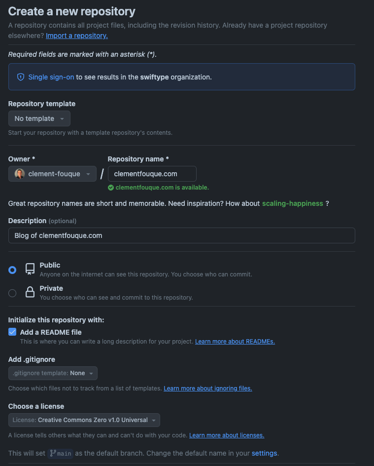
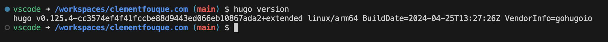
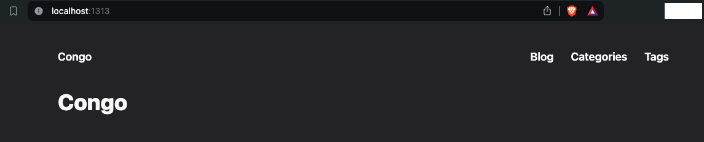
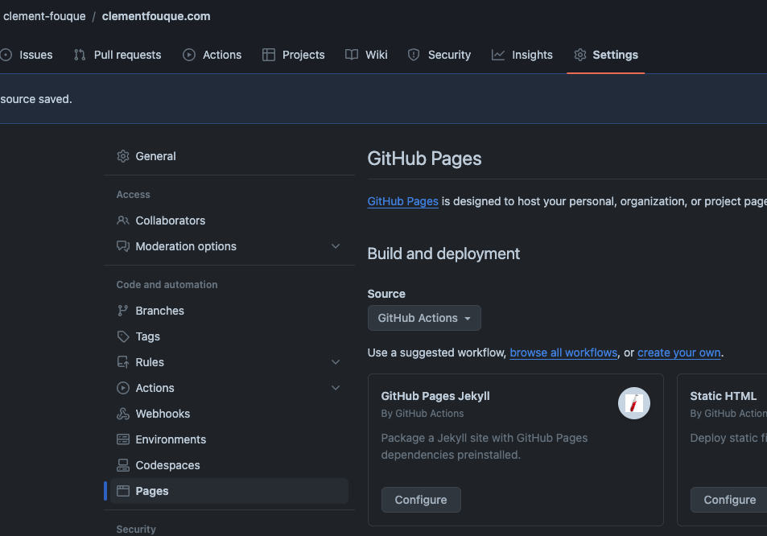
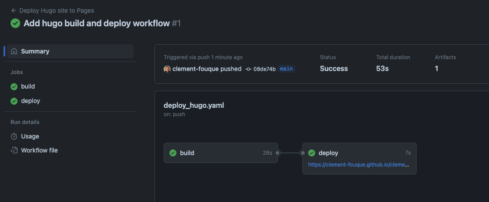
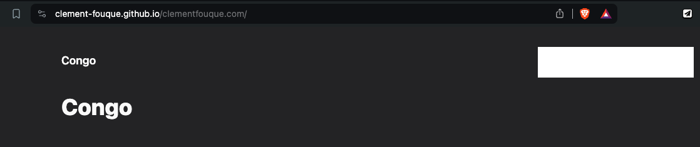
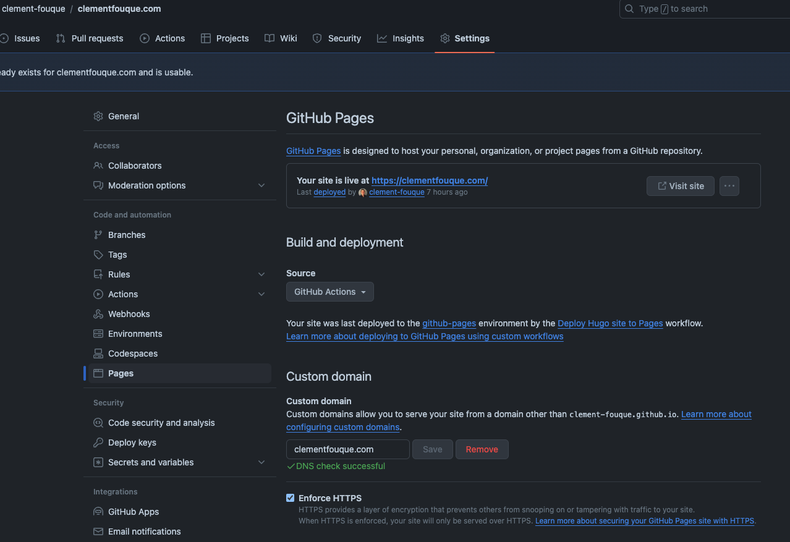

+++
title = "Static Site Generator: Why and how I've built my blog with Hugo"
date = 2024-05-24
summary = "Discover why and how a static site generator like Hugo can be a game-changer for your blog's security, performance, and cost efficiency."
slug = 'hugo-static-site-blog'
draft = false
+++

In this blog post, I'll explain why I've chosen the Hugo static site generator for my blog, how I built it, and how it's hosted.

## Why using a static site generator and which one ?

- **Security**: I wanted something simple to maintain over time. Working in vulnerability management, I know the importance of updating a website regularly. By using a static website, I no longer have to maintain a server and update it.
- **Performance**: Static websites have excellent performance as no server-side rendering is performed when a user makes a request. It's done when the website is generated (build time).
- **Cost efficiency**: Let's face it; this blog will never have thousands of users. I wanted something cheap that I could host for a long time. Hosting static websites with GitHub Pages is free, even with a custom domain. As I'm using GitHub daily, it's a natural choice.

There are many static website generators like [Jekyll](https://jekyllrb.com/), [Gatsby](https://www.gatsbyjs.com/), [Hugo](https://gohugo.io/), [Eleventy](https://www.11ty.dev/), etc. I've chosen Hugo as there are [many free themes](https://themes.gohugo.io/), it's based on Golang, which I wanted to learn, and it has a super-fast build time compared to others. I didn't read nor write any Golang code, as it was unnecessary.

## Creating a GitHub repository

### Creating a new repo in private

I named the repository as the final domain that will be used to access the blog. To use GitHub Pages, we need to set the repository as public. For the licensing part, I followed the recommendation from GitHub as it's only text and not software that will be shared. I decided to use the Creative Commons license.

The _.gitignore_ file will be generated later on.



Then, I cloned the repository locally. I'm a big fan of GitHub Desktop as I don't need to remember the Git commands. I added a _.gitignore_ file generated from [toptal.com](https://www.toptal.com/developers/gitignore?templates=git,macos,visualstudiocode,hugo) with modules _git_, _MacOS_, _VisualStudioCode_, and _Hugo_. Due to the structure of my project (the Hugo site is in a subfolder), I modified the folder exceptions related to Hugo by adding _blog/_. I have the following:

```
### Hugo ###
# Generated files by hugo
blog/public/
blog/resources/_gen/
blog/assets/jsconfig.json

...

# Temporary lock file while building
blog/.hugo_build.lock
```

## Configuring the dev environment on a remote container

Docker needs to be installed on the system. [Install instructions](https://docs.docker.com/engine/install/) can be found on docker website.


I'm not a big fan of installing software on my workstation. I prefer to leverage Docker containers. Visual Studio Code has awesome capabilities to develop within a container, and it's fairly easy to set up.

First, I checked that the [Visual Studio Code Dev Containers extension](https://marketplace.visualstudio.com/items?itemName=ms-vscode-remote.remote-containers) is installed.

Then, I configured the workspace to “reload” in a container. I clicked the bottom left blue button and selected *Reopen in Container* and then *Add configuration to workspace* and finally *Show All Defintions*. I chose those options:

- Image: Go default version (1.22-bookworm at the time of writting)
- Feature: Hugo
- Configure options: custom (add extended)

It takes some time for the container to be created, especially at the beginning as the Docker image needs to be downloaded. All the container configuration is located under _.devcontainer/devcontainer.json_. My file looks like the following (comments removed):

```json
{
	"name": "Go",
	// Or use a Dockerfile or Docker Compose file. More info: https://containers.dev/guide/dockerfile
	"image": "mcr.microsoft.com/devcontainers/go:1-1.22-bookworm",
	"features": {
		"ghcr.io/devcontainers/features/hugo:1": {
			"extended": true,
			"version": "latest"
		}
	}

	// ...
}
```

To make sure my setup is correct, I checked the Hugo version with `hugo version`.



## Creating a Hugo website locally

To create a new Hugo site, I executed this simple command: `hugo new site blog`. It creates a new blog folder with all required files inside.

I launched the site with `hugo server --source blog/ -D`. I have a "Page Not Found" error, I think it's because I haven't configure port forwarding correctly.

## Setting up the Hugo theme

### Theme selection

There are plenty of options in the [Hugo themes gallery](https://themes.gohugo.io/). GitHub's [hugo-theme topic](https://github.com/topics/hugo-theme) seems to be a good source to find other themes.

### Download Congo theme source

To easily refer to the theme, I associated the Git repository of the Hugo Congo theme with the command `git submodule add https://github.com/jpanther/congo.git themes/congo`.

### Configure the site to use Congo theme

To initialize the modules for the Hugo site, I executed `hugo mod init github.com/clement-fouque/blog.clementfouque.com --source blog/` .

And I imported the config files from the Congo theme previously downloaded.

```bash
HUGO_SITE_NAME="blog"
mkdir -p $HUGO_SITE_NAME/config/_default
cp themes/congo/config/_default/config.toml $HUGO_SITE_NAME/config/_default/config.toml
cp themes/congo/config/_default/languages.en.toml $HUGO_SITE_NAME/config/_default/languages.en.toml
cp themes/congo/config/_default/markup.toml $HUGO_SITE_NAME/config/_default/markup.toml
cp themes/congo/config/_default/menus.en.toml $HUGO_SITE_NAME/config/_default/menus.en.toml
cp themes/congo/config/_default/params.toml $HUGO_SITE_NAME/config/_default/params.toml
```

Finally, I created a config file `code $HUGO_SITE_NAME/config/_default/module.toml` and added the following content:

```toml
[[imports]]
path = "github.com/jpanther/congo/v2"
```

Test of the website with `hugo server --source blog/ -D` finally gave some results. The website is accessible through [http://localhost:1313](http://localhost:1313/). 



Now that the website is working, I modified the config files under _blog/config/_default_ . The [getting started documentation](https://jpanther.github.io/congo/docs/getting-started/) of the Congo theme is really complete. 

Then, I created a first blog post with `hugo new content $HUGO_SITE_NAME/posts/my-first-post.md`

## Deploying the site

### Adding build and deploy workflow GitHub Actions

GitHub offers the possibility to host static websites for free through GitHub Pages. In the Settings of the GitHub project, I set the Source to *GitHub Actions* (under *Build and deployment)* in the *Pages* section.



I added a workflow that will deploy my static website. The file is named _.github/workflows/deploy_hugo.yaml_ (the name can be changed, but not the folder). I modified the website with the help of the Hugo documentation to account for my folder structure (site under _/blog_ folder). Here is my final file, after updating multiple actions to their latest versions:

```yaml
# Sample workflow for building and deploying a Hugo site to GitHub Pages
name: Deploy Hugo site to Pages

on:
  # Runs on pushes targeting the default branch
  push:
    branches:
      - main

  # Allows you to run this workflow manually from the Actions tab
  workflow_dispatch:

# Sets permissions of the GITHUB_TOKEN to allow deployment to GitHub Pages
permissions:
  contents: read
  pages: write
  id-token: write

# Allow only one concurrent deployment, skipping runs queued between the run in-progress and latest queued.
# However, do NOT cancel in-progress runs as we want to allow these production deployments to complete.
concurrency:
  group: "pages"
  cancel-in-progress: false

# Default to bash
defaults:
  run:
    shell: bash
    # working-directory: ./blog

jobs:
  # Build job
  build:
    runs-on: ubuntu-latest
    env:
      HUGO_VERSION: 0.125.4
    steps:
      - name: Install Hugo CLI
        run: |
          wget -O ${{ runner.temp }}/hugo.deb https://github.com/gohugoio/hugo/releases/download/v${HUGO_VERSION}/hugo_extended_${HUGO_VERSION}_linux-amd64.deb \
          && sudo dpkg -i ${{ runner.temp }}/hugo.deb          
      - name: Install Dart Sass
        run: sudo snap install dart-sass
      - name: Checkout
        uses: actions/checkout@v4
        with:
          submodules: recursive
          fetch-depth: 0
      - name: Setup Pages
        id: pages
        uses: actions/configure-pages@v5
      - name: Install Node.js dependencies
        run: "[[ -f package-lock.json || -f npm-shrinkwrap.json ]] && npm ci || true"
      # - name: Ensure public folder exists
      #   run: "mkdir -p public"
      - name: Build with Hugo
        env:
          # For maximum backward compatibility with Hugo modules
          HUGO_ENVIRONMENT: production
          HUGO_ENV: production
        run: |
          # Change working directory to the blog folder to have relative paths based on the blog folder
          cd blog

          # Build the Hugo site
          hugo \
            --gc \
            --minify \
            --baseURL "${{ steps.pages.outputs.base_url }}/"   
      - name: Upload artifact
        uses: actions/upload-pages-artifact@v3
        with:
          path: ./blog/public

  # Deployment job
  deploy:
    environment:
      name: github-pages
      url: ${{ steps.deployment.outputs.page_url }}
    runs-on: ubuntu-latest
    needs: build
    steps:
      - name: Deploy to GitHub Pages
        id: deployment
        uses: actions/deploy-pages@v4
```

I committed this modification (under the main branch) and monitored the deployment under the *Actions* section of the GitHub repository.  



I checked the link from the deploy job to confirm that the deployment was successful: [https://clement-fouque.github.io/clementfouque.com/](https://clement-fouque.github.io/clementfouque.com/). Now, each time code is pushed to the main branch, the website will be rebuilt and deployed.



## Adding a domain to GitHub Pages

### DNS configuration

As recommended by [GitHub documentation](https://docs.github.com/en/pages/configuring-a-custom-domain-for-your-github-pages-site/managing-a-custom-domain-for-your-github-pages-site), I pointed my apex domain to the 4 IPv4s associated with GitHub Pages using an A record.

```
185.199.108.153
185.199.109.153
185.199.110.153
185.199.111.153
```

I also configured the IPv6 addresses because, well, why not?

```
2606:50c0:8000::153
2606:50c0:8001::153
2606:50c0:8002::153
2606:50c0:8003::153
```

### Configuring the apex domain on GitHub

In the settings of the GitHub repository, the *Pages* section, I added my domain. I had to wait several minutes for the DNS check to be successful.



I encountered an issue where the CSS was not loading. I redeployed the website, and it was fixed.

## Conclusion

Using a static site generator for my blog has been a great decision. It has provided a simple, secure, and cost-effective solution for maintaining my blog.